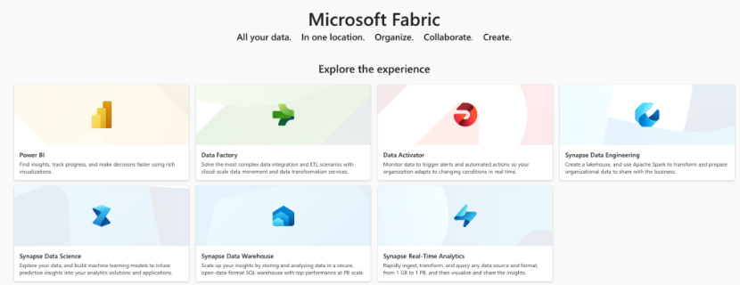

# Advent of 2023, Day 1 – What is Microsoft Fabric?

Microsoft Fabric is a next-gen platform, that brings all-in-one data and analytics solutions for end users, small, medium and large enterprises. Services offer the complete data cycle movement (data ingestion, data engineering, data integration, data storing with warehouse using one lake), delivering data insights and building predictive models. 

 

Consolidated and same experience across all the services in this platform, gives it a unique mark, that is emplified by ease of use, amazing integration between services and faster time to market. This platform is built on the foundation of Saas (Software as a Service)  and brings together Data Engineering, Data Factory, Data Science, Data Warehouse, Real-Time Analytics, and Power BI onto a shared SaaS foundation. Security, roles, capabilities and all other permissions are set centrally and automatically applied to all the underlying services.

## Components of Microsoft Fabric

Microsoft Fabric offers all the tools needed for creating and using analytical tools. These tools are tailored to a specific persona, task or department. This can also be seen in the offerings when creating end-to-end solutions.  The underlying services are:

* Data Engineering - Data Engineering experience provides a world class Spark platform with great authoring experiences, enabling data engineers to perform large scale data transformation and democratize data through the lakehouse. Microsoft Fabric Spark's integration with Data Factory enables notebooks and spark jobs to be scheduled and orchestrated. 

* Data Factory - Azure Data Factory combines the simplicity of Power Query with the scale and power of Azure Data Factory. You can use more than 200 native connectors to connect to data sources on-premises and in the cloud. 

* Data Science - Data Science experience enables you to build, deploy, and operationalize machine learning models seamlessly within your Fabric experience. It integrates with Azure Machine Learning to provide built-in experiment tracking and model registry. Data scientists are empowered to enrich organizational data with predictions and allow business analysts to integrate those predictions into their BI reports. This way it shifts from descriptive to predictive insights. 

* Data Warehouse - Data Warehouse experience provides industry leading SQL performance and scale. It fully separates compute from storage, enabling independent scaling of both components. Additionally, it natively stores data in the open Delta Lake format. 

* Real-Time Analytics - Observational data, which is collected from various sources such as apps, IoT devices, human interactions, and so many more. It's currently the fastest-growing data category. This data is often semi-structured in formats like JSON or Text. It comes in at high volume, with shifting schemas. These characteristics make it hard for traditional data warehousing platforms to work with. Real-Time Analytics is best in class engine for observational data analytics. 

* Power BI - Power BI is the world's leading Business Intelligence platform. It ensures that business owners can access all the data in Fabric quickly and intuitively to make better decisions with data. 

 * Data Activator - Ia taking actions when patterns or conditions are detected in changing data. It monitors data in Power BI reports and Eventstreams items. It then automatically takes appropriate action such as alerting users or kicking off Power Automate workflows.

 
 
 
## How to get started?

All you need is an Azure subscription (you can get one for free). Once you register and login, one last thing is a dataset and a problem you wish to solve. Microsoft Fabric is now (as of writing this blogpost) generally available.

Tomorrow we will look into starting a Fabric service and create a simple underlying service.

Compete set of code, documents, notebooks, and all of the materials will be available at the Github repository: https://github.com/tomaztk/Microsoft-Fabric

Happy Advent of 2023! 🙂